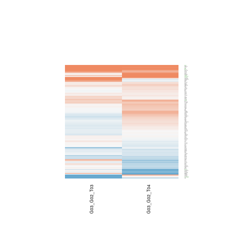
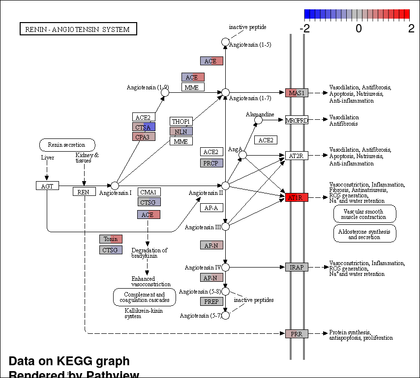
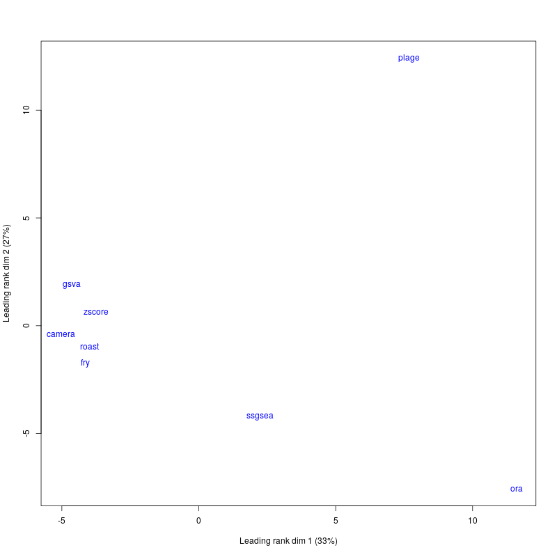
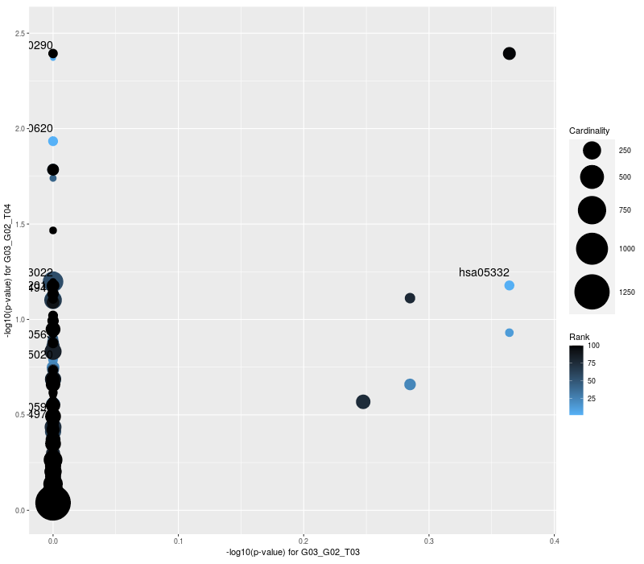
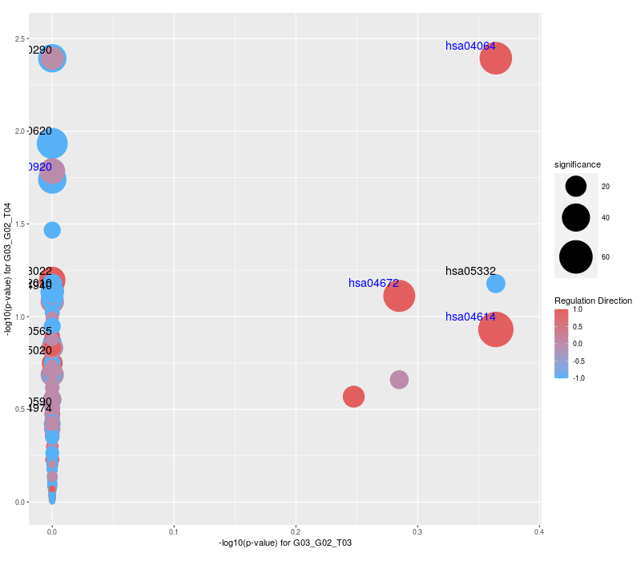
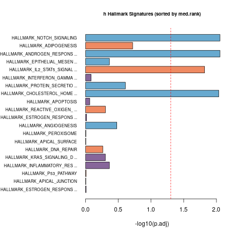
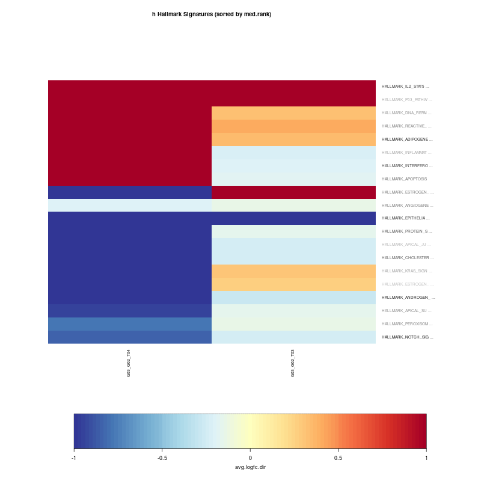

```{r setup, include=FALSE}

# to run locally replace www with tutorials/05_ensemble_gene_set_enrichment_analysis/www

# libraries
suppressPackageStartupMessages({
  library(dplyr)
  library(edgeR)
  library(EGSEA)
  library(EGSEAdata)
  library(here)
  library(learnr)
  library(limma)
  library(org.Hs.eg.db)
  library(readr)
  library(tibble)
  library(UpSetR)
})

# options
knitr::opts_chunk$set(echo = FALSE)
tutorial_options(
  exercise.reveal_solution=TRUE,
  exercise.lines=10)

```

## Introduction

The aim is to reproduce the analysis from the [Alhamdoosh _et al._, 2017](https://academic.oup.com/bioinformatics/article/33/3/414/2875813) manuscript on our data. For that, we will need to:

1. create a DGEList object for edgeR using our tximport data.
2. select the EGSEA database we want and build the index
3. prepare EGSEA
4. run EGSEA
5. look at the results

## Differential Expression using `edgeR` 
### `DGEList()` creation

Here we inspire ourselves from the [tximport]() vignette. We read the txi and sample files, as we did for DESeq2. We then use the `org.Hs.eg.db` to extract cross-references, as the `EGSEA` package relies on ENTREZ IDs.

```{r edgeR, exercise=TRUE, exercise.eval=TRUE,exercise.lines=35}
suppressPackageStartupMessages({
  library(dplyr)
  library(edgeR)
  library(here)
  library(org.Hs.eg.db)
  library(readr)
  library(tibble)
})

txi <- readRDS(here("tutorials/05_ensemble_gene_set_enrichment_analysis/www/tximport.rds"))

counts <- round(txi$counts)

sample_file <- here("tutorials/05_ensemble_gene_set_enrichment_analysis/www/samples_table.tsv")

samples <- read_tsv(sample_file,col_types=c("cfff")) %>% tibble::column_to_rownames("sample_id") %>% as.data.frame()

ensembl.id <- sub("\\.\\d+$","",rownames(counts))

genetable <- select(org.Hs.eg.db,keys=ensembl.id,
                               columns=c("ENTREZID","SYMBOL"),keytype="ENSEMBL")

nrow(genetable[match(ensembl.id,genetable$ENSEMBL),])

nrow(genetable)

genetable <- cbind(gene.id=ensembl.id,genetable[match(ensembl.id,genetable$ENSEMBL),])

stopifnot(all(rownames(samples) == colnames(counts)))

dge <- DGEList(counts = counts, 
               samples = samples, 
               genes = genetable)

```

Now that we have created a `DGELlist` object, we can use the transcript length information to calculate the library size factor (offset) correction.

```{r offset, exercise=TRUE, exercise.eval=TRUE, exercise.setup="edgeR"}
avetxlengths <- txi$length
stopifnot(all(rownames(avetxlengths) == rownames(counts)))
stopifnot(all(colnames(avetxlengths) == colnames(counts)))
avetxlengths <- avetxlengths/exp(rowMeans(log(avetxlengths)))
offsets <- log(calcNormFactors(counts/avetxlengths)) + 
  log(colSums(counts/avetxlengths))
dge <- scaleOffset(dge, t(t(log(avetxlengths)) + offsets))
names(dge)
```

As we provide library size factors, running the following just report that it is unnecessary to run that step.

```{r normFactor, exercise=TRUE, exercise.eval=TRUE, exercise.setup="offset",exercise.lines=3}
dge <- calcNormFactors(dge)
```

Before proceeding, we want to remove uninformative genes. For that, we can (cheat a little) reuse the independent filtering results from DESeq (we could also recalculate them using `edgeR` - see its vignette for details).

```{r indp, exercise=TRUE, exercise.eval=TRUE, exercise.setup="normFactor"}
res <- readRDS(here("tutorials/05_ensemble_gene_set_enrichment_analysis/www/G03_vs_G02_at_T04.rds"))

suppressPackageStartupMessages(filt.sel <- !is.na(res$padj))

dge <- dge[filt.sel,]

dim(dge)
```

Now that the object is ready, we can finally change the IDs from EnsEMBL to Entrez. This ends up being messy as about 10% of the genes have no cross-reference between the two. Then, a few (14) EnsEMBL genes are associated to 7 Entrez IDs. We need to filter these duplicates. To achieve that, we keep the EnsEMBL genes with the lowest FDR.


```{r xref, exercise=TRUE, exercise.eval=TRUE, exercise.setup="indp",exercise.lines=25}
na.sel <- !is.na(dge$genes$ENTREZID)

dge <- dge[na.sel,]

sel <- which(duplicated(dge$genes$ENTREZID))

length(sel)

dup.sel <- dge$genes$ENTREZID %in% dge$genes$ENTREZID[sel]

dge[dup.sel,]

dge$genes$ENTREZID[dup.sel]

res[filt.sel,][na.sel,][dup.sel,]

pos <- which(dup.sel)

ord <- order(res[filt.sel,][na.sel,][dup.sel,"padj"])

ord.sel <- pos[ord][duplicated(dge$genes$ENTREZID[dup.sel][ord])]

dge <- dge[-ord.sel,]

rownames(dge) <- dge$genes$ENTREZID
```

Finally, we are done!

### Experimental design

Here, we just create the design: $expression = time * treament$

```{r design, exercise=TRUE, exercise.eval=TRUE, exercise.setup="xref",exercise.lines=5}
design = model.matrix(~dge$samples$time*dge$samples$treatment)
colnames(design) = gsub("dge\\$samples\\$time", "", colnames(design))
colnames(design) = gsub("dge\\$samples\\$treatment", "", colnames(design))
head(design)
```

### Contrasts

Here, we define the contrasts to retrieve the genes DE between G03 and G02 at either T03 or T04.

```{r contrast, exercise=TRUE, exercise.eval=TRUE, exercise.setup="design",exercise.lines=4}
contr.matrix = cbind(G03_G02_T03=c(0,0,1,0),
                     G03_G02_T04=c(0,0,1,1))
head(contr.matrix)
```

### Normalisation

Finally, we `voom` transform the data.

```{r norm, exercise=TRUE, exercise.eval=TRUE, exercise.setup="contrast",exercise.lines=3}
v = voom(dge, design, plot=TRUE)
```

Now we can move on to set up EGSEA

## EGSEA

Here, we will:

1. select the data and index it
2. prepare and run EGSEA

### Data

We load the EGSEA human dataset and select the following Molecule Signature DB collections:

1. Hallmark (h)
2. Curated Gene Sets (c2)
3. Oncogenic Signatures (c6)
4. Immunologic Signatures (c7)

before indexing these (KEGG is included by default). We skip GO as we have done that analysis previously.

```{r data, exercise=TRUE, exercise.eval=TRUE, exercise.setup="norm", exercise.timelimit=600,exercise.lines=15}
suppressPackageStartupMessages({
  library(EGSEAdata)
  library(EGSEA)
})

egsea.data("human")

info <-  egsea.data("human", returnInfo = TRUE)

names(info)

info$msigdb$info$collections

gs.annots <- buildIdx(entrezIDs=v$genes$ENTREZID, species="human",
                     msigdb.gsets=c("h", "c2", "c6", "c7"))

symbolsMap <- v$genes[, c(3, 4)]

colnames(symbolsMap) <- c("FeatureID", "Symbols")
```

### Run

Now, we set up (I went for defaults) and run `egsea()`. It took a couple runs to find out four methods that would fail on that dataset. It will run for awhile (10 minutes).

```{r gsea, exercise=TRUE, exercise.eval=TRUE, exercise.setup="data", exercise.timelimit=600,exercise.lines=10}
egsea.base()

baseMethods = egsea.base()[-c(3:5,10)]

gsa = egsea(voom.results=v, contrasts=contr.matrix,
            gs.annots=gs.annots, symbolsMap=symbolsMap,
            baseGSEAs=baseMethods, sort.by="med.rank",
            num.threads = 4, report = FALSE)
```

Finally, it ran and we can now explore the results. You can also scroll down to see how the report was generated.

---

```{r load, include=FALSE}
gsa <- readRDS(here("tutorials/05_ensemble_gene_set_enrichment_analysis/www/gsa.rds"))
```

The details and summary.

```{r show, exercise=TRUE, exercise.eval=FALSE, exercise.setup="load",exercise.lines=3}
show(gsa)
summary(gsa)
```

---

Inspecting the different sets

```{r topSets, exercise=TRUE, exercise.eval=FALSE, exercise.setup="load", exercise.timelimit=600,exercise.lines=10}
topSets(gsa, gs.label="h", contrast = "G03_G02_T03", names.only=TRUE)

topSets(gsa, gs.label="h", contrast = "G03_G02_T04", names.only=TRUE)

topSets(gsa, gs.label="h", contrast = "comparison", names.only=TRUE)

t = topSets(gsa, gs.label="kegg",contrast = "comparison",names.only=FALSE, number = Inf, verbose = FALSE)
            
t[grep("Melanoma", rownames(t)), ]

t[1, ]
```

---

We can make a simple comparison for the kegg terms between the two contrasts and the comparison

```{r upset, exercise=TRUE, exercise.eval=FALSE, exercise.setup="load", exercise.timelimit=600}
library(UpSetR)
upset(fromList(list(T04=topSets(gsa, gs.label="kegg", contrast="G03_G02_T04", sort.by="med.rank"),
T03=topSets(gsa, gs.label="kegg", contrast="G03_G02_T03", sort.by="med.rank"),
Comp=topSets(gsa, gs.label="kegg", contrast="comparison", sort.by="med.rank"))))
```

---

Now we can visualise the results. We can look at:

* heatmaps.

```{r heatmaps, exercise=TRUE, exercise.eval=FALSE, exercise.setup="load", exercise.timelimit=600}

plotHeatmap(gsa, gene.set="HALLMARK_IL2_STAT5_SIGNALING", gs.label="h",
            contrast = "comparison",format="png",
            file.name="images/heatmap_h_comparison")
```

{width=100%}

* pathways

```{r pathways, exercise=TRUE, exercise.eval=FALSE, exercise.setup="load", exercise.timelimit=600}
plotPathway(gsa, gene.set = "Renin-angiotensin system",
            contrast = "comparison", gs.label = "kegg",
            file.name="images/pathway_kegg_comparison")
```

{width=100%}

* methods

```{r methods, exercise=TRUE, exercise.eval=FALSE, exercise.setup="load", exercise.timelimit=600}
plotMethods(gsa, gs.label = "h", contrast = "G03_G02_T04",format="png",
            file.name="images/methods_h")
```

{width=100%}

* summaries

```{r summaries, exercise=TRUE, exercise.eval=FALSE, exercise.setup="load", exercise.timelimit=600}
plotSummary(gsa, gs.label = "kegg", contrast = c(1,2), format="png",
            file.name="images/summary-kegg")
```

{width=100%}
{width=100%}

* barplots

```{r barplots, exercise=TRUE, exercise.eval=FALSE, exercise.setup="load", exercise.timelimit=600}
plotBars(gsa, gs.label = "h", contrast = "comparison", format="png",
         file.name="images/barplot-kegg")
```

{width=100%}

* summary heatmaps

```{r sumheatmap, exercise=TRUE, exercise.eval=FALSE, exercise.setup="load", exercise.timelimit=600}
plotSummaryHeatmap(gsa, gs.label="h", hm.vals = "avg.logfc.dir",format="png",
                   file.name="images/summary-heatmap-h")
```

{width=100%}

---

We can also look at the DE results

```{r results, exercise=TRUE, exercise.eval=FALSE, exercise.setup="load", exercise.timelimit=600}
t = limmaTopTable(gsa, contrast=2)
head(t)
```

## Report
This takes a long time...
```{r report, eval=FALSE, echo=TRUE}
 generateReport(gsa, number = 10, report.dir=here("tutorials/05_ensemble_gene_set_enrichment_analysis/www/analysis/G03-G02-egsea-report"))
```

## Session Info
It is good practice and highly recommended to always include the session info in your analyses. This way other can reproduce them with the exact same versions of the packages you used. Use the help to find out how to print the session info.

```{r session-info, exercise=TRUE, exercise.eval=TRUE}

```

```{r session-info-hint}
sessionInfo()
```

## Copyright
This material is provided under the following license:

`CC-BY-NC-SA 4.0: `Creative Commons Attribution-NonCommercial-ShareAlike 4.0 International Public License`
